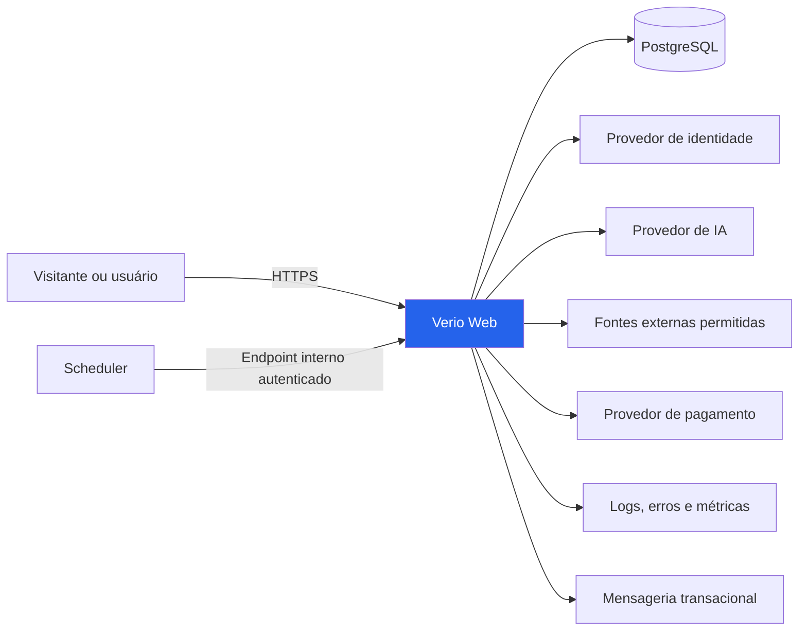
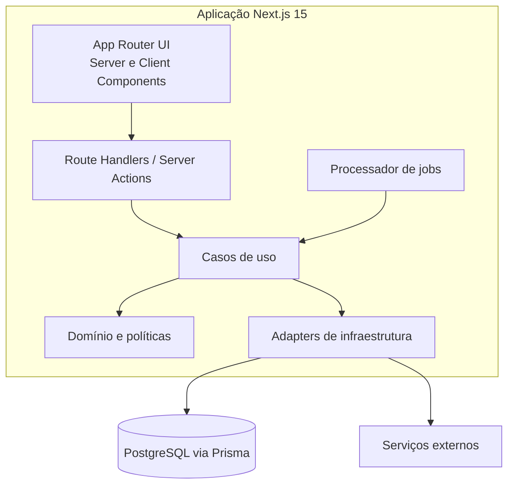
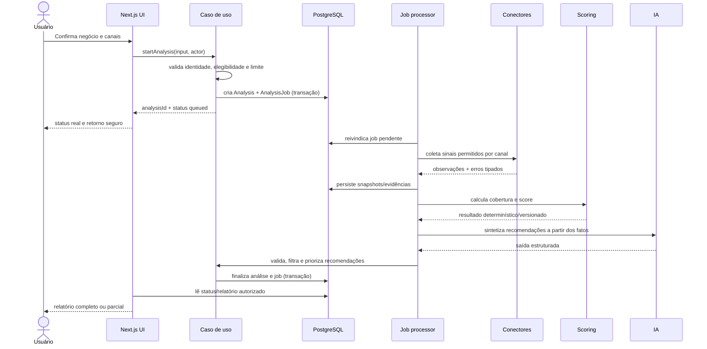
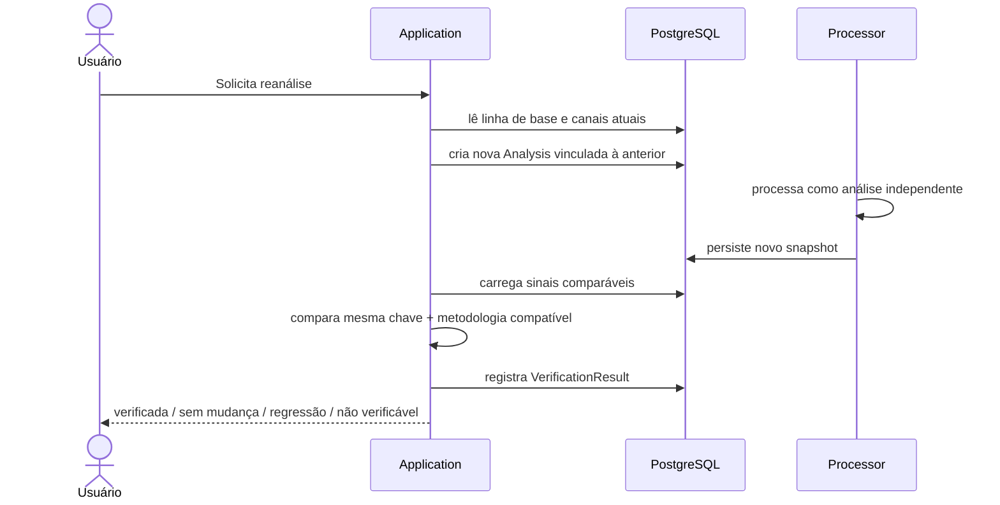
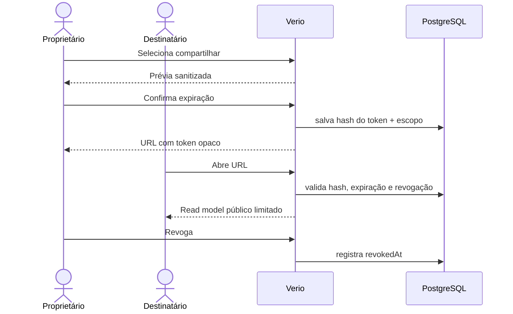
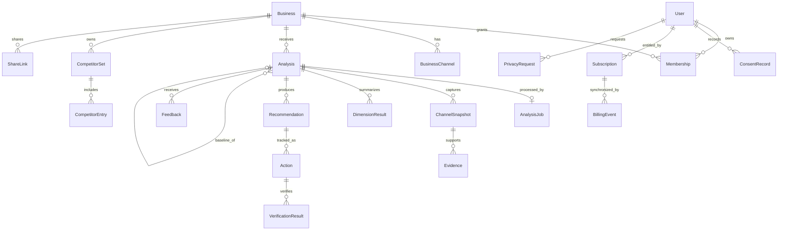
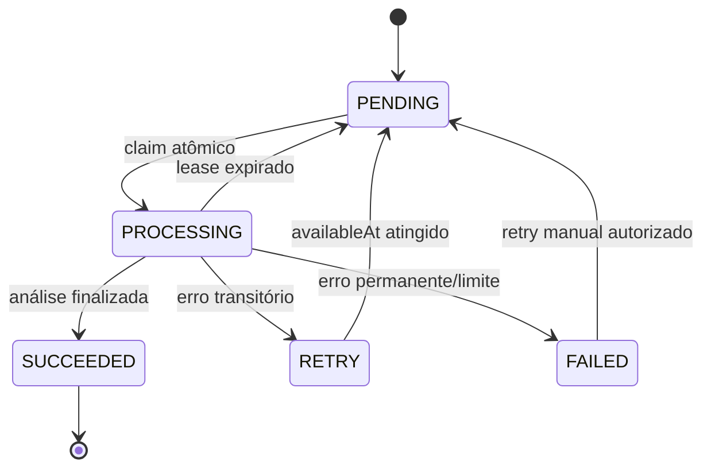
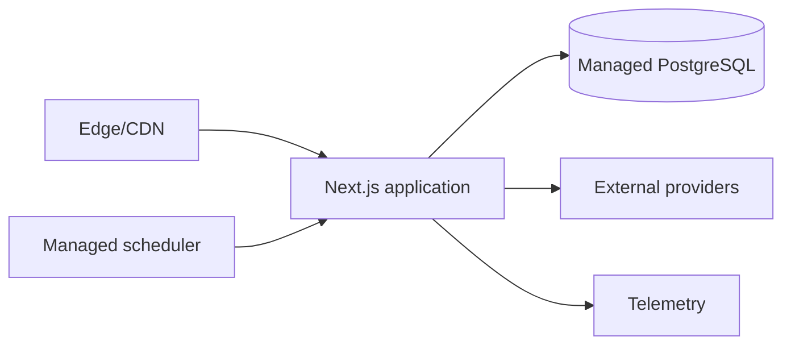

# Arquitetura do Sistema — Verio

**Fase 3 — Arquitetura**
**Versão:** 1.0
**Data:** 27 de julho de 2026
**Status:** arquitetura proposta; nenhuma funcionalidade implementada
**Documentos-base:** [Product Foundation](./product-foundation-verio.md) e [Product Blueprint](./product-blueprint-verio.md)

> Esta arquitetura otimiza o MVP para simplicidade, explicabilidade e aprendizagem. Ela não tenta antecipar multilocais, agências, microsserviços ou escala global. Toda abstração deve justificar um requisito atual do Blueprint.

---

## 1. Resumo da decisão

O Verio será inicialmente um **monólito modular em Next.js 15**, com TypeScript, App Router, Tailwind CSS, componentes Shadcn UI, Prisma e PostgreSQL. A aplicação web, a API interna e o processamento dos casos de uso ficam no mesmo repositório e no mesmo artefato de deploy.

Análises potencialmente demoradas serão executadas como **jobs persistidos no PostgreSQL**, consumidos por um endpoint interno acionado por scheduler. Isso preserva a experiência assíncrona exigida pelo Blueprint sem introduzir fila, broker ou serviço de workers no MVP. Caso volume, latência ou isolamento tornem essa solução insuficiente, o processador poderá migrar para uma fila gerenciada sem alterar os casos de uso ou o modelo do domínio.

### Decisões principais

| Tema | Decisão MVP | Por quê |
|---|---|---|
| Estilo | Monólito modular | Menos deploys e contratos distribuídos; módulos continuam separados |
| Aplicação | Next.js 15 com App Router | UI, servidor e rotas no mesmo produto |
| Linguagem | TypeScript em modo estrito | Contratos explícitos e uma linguagem ponta a ponta |
| UI | Tailwind CSS + Shadcn UI | Composição acessível sem criar framework visual próprio |
| Persistência | PostgreSQL + Prisma | Transações, integridade relacional e histórico auditável |
| Processamento | Job table + scheduler protegido | Assíncrono simples e persistente |
| IA | Provider adapter + saída estruturada validada | Evita acoplamento e texto não verificável |
| Fatos/score | Regras determinísticas versionadas | Reprodutibilidade e contestação |
| Autenticação | Provedor de identidade por adapter | Segurança não deve ser reinventada; escolha comercial permanece aberta |
| Arquivos | Sem object storage no primeiro corte | Relatórios são dados estruturados/renderizados sob demanda |
| Cache | Sem Redis | Cache do framework e PostgreSQL bastam até evidência contrária |
| API pública | Não | Nenhum consumidor externo no MVP |
| Deploy | Uma aplicação + PostgreSQL gerenciado + scheduler | Menor superfície operacional |

### Restrições arquiteturais

1. Nenhum dado ausente pode virar score zero por acidente.
2. Toda constatação factual precisa de fonte, momento de observação e estado de verificação.
3. Resultados históricos são imutáveis; nova metodologia gera nova versão/análise.
4. IA não decide identidade do negócio, score ou elegibilidade sem validação determinística.
5. Jobs devem ser idempotentes e retomáveis.
6. Dados privados não podem entrar em logs, telemetria ou prompts sem necessidade explícita.
7. UI não acessa Prisma diretamente.
8. Módulos de domínio não importam Next.js, React ou SDKs de provedores.

---

## 2. Escopo arquitetural

### Incluído

- Aplicação web responsiva e acessível.
- Identificação e confirmação do negócio/canais.
- Conta, autenticação e consentimentos.
- Análise completa, parcial ou falha.
- Score explicável, dimensões, sinais e evidências.
- Recomendações, ações e reanálise.
- Até três concorrentes opcionais.
- Relatório compartilhável e revogável.
- Feedback/contestação.
- Oferta, assinatura/cancelamento por adapter de pagamento.
- Instrumentação, auditoria operacional e exclusão.

### Deliberadamente fora

- Microsserviços, Kubernetes, event streaming e CQRS.
- GraphQL, API pública e SDK.
- Aplicativo nativo.
- Busca vetorial/RAG e vector database.
- Data warehouse dedicado.
- Redis, Elasticsearch e object storage sem requisito comprovado.
- Multi-tenant enterprise, RBAC complexo e multilocais.
- Treinamento/fine-tuning de modelo próprio.

---

## 3. Contexto e componentes

### 3.1 Diagrama de contexto



As integrações ID, AI, PAY, OBS e MSG são portas substituíveis. “Fontes externas permitidas” não autoriza scraping indiscriminado: cada conector depende de revisão de termos, finalidade e retenção.

### 3.2 Diagrama de contêineres lógicos



“Contêineres lógicos” são pastas e limites no mesmo deploy, não serviços independentes.

### 3.3 Dependências permitidas

```text
UI/HTTP  ───────► Application ───────► Domain
                       │
                       ▼
                 Infrastructure ─────► Providers / Prisma
```

- `domain` não importa `application`, `infrastructure`, React ou Next.js.
- `application` importa tipos e políticas do domínio, mas depende de interfaces/ports para I/O.
- `infrastructure` implementa as ports e pode importar Prisma/SDKs.
- `app` compõe casos de uso, autorização, validação HTTP e apresentação.
- Não criar interfaces para toda função. Ports existem apenas em fronteiras externas ou variáveis.

---

## 4. Estrutura de pastas

```text
verio/
├── docs/
│   ├── product-foundation-verio.md
│   ├── product-blueprint-verio.md
│   ├── architecture-verio.md
│   └── adr/
│       └── README.md
├── prisma/
│   ├── schema.prisma
│   ├── migrations/
│   └── seed.ts                    # somente dados locais/de demonstração
├── public/
│   └── ...                        # assets estáticos, sem relatórios privados
├── src/
│   ├── app/
│   │   ├── (marketing)/
│   │   │   ├── page.tsx
│   │   │   └── privacidade/page.tsx
│   │   ├── (product)/
│   │   │   ├── analisar/
│   │   │   ├── analises/[analysisId]/
│   │   │   ├── negocios/[businessId]/
│   │   │   └── configuracoes/
│   │   ├── compartilhar/[token]/
│   │   ├── api/
│   │   │   ├── webhooks/[provider]/route.ts
│   │   │   ├── internal/jobs/process/route.ts
│   │   │   └── health/route.ts
│   │   ├── layout.tsx
│   │   ├── error.tsx
│   │   ├── loading.tsx
│   │   └── not-found.tsx
│   ├── modules/
│   │   ├── identity/
│   │   ├── businesses/
│   │   ├── analyses/
│   │   ├── scoring/
│   │   ├── recommendations/
│   │   ├── competitors/
│   │   ├── reports/
│   │   ├── feedback/
│   │   ├── billing/
│   │   └── privacy/
│   ├── components/
│   │   ├── ui/                    # Shadcn, pouco alterado
│   │   └── shared/                # componentes realmente reutilizados
│   ├── lib/
│   │   ├── db/
│   │   ├── auth/
│   │   ├── ai/
│   │   ├── sources/
│   │   ├── billing/
│   │   ├── messaging/
│   │   ├── observability/
│   │   ├── validation/
│   │   └── env/
│   ├── styles/
│   │   └── globals.css
│   └── test/
│       ├── factories/
│       ├── fixtures/
│       └── setup/
├── instrumentation.ts
├── middleware.ts                  # somente se autenticação/headers exigirem
├── next.config.ts
├── components.json
├── tailwind.config.ts             # se requerido pela versão adotada
├── tsconfig.json
└── package.json
```

### 4.1 Estrutura interna de um módulo

```text
src/modules/analyses/
├── domain/
│   ├── analysis.ts
│   ├── analysis-status.ts
│   ├── evidence.ts
│   └── policies.ts
├── application/
│   ├── start-analysis.ts
│   ├── process-analysis.ts
│   ├── get-analysis-report.ts
│   └── ports.ts
├── infrastructure/
│   ├── analysis-repository.prisma.ts
│   └── analysis-job-repository.prisma.ts
├── ui/
│   ├── analysis-status.tsx
│   └── report-summary.tsx
├── schemas/
│   └── analysis-input.ts
└── index.ts
```

Nem todo módulo precisa de todas as pastas. Começar com arquivos simples e criar subpastas quando houver três ou mais responsabilidades. O `index.ts` expõe apenas a API pública do módulo; imports externos não atravessam internals.

### 4.2 Regras de localização

- Componente usado por uma rota: fica junto da rota.
- Componente específico de domínio usado em mais de uma rota: `modules/<módulo>/ui`.
- Primitive visual reutilizável: `components/ui`.
- Utilitário sem domínio e amplamente reutilizado: `lib`.
- Regra de negócio: `modules/<módulo>/domain`, nunca `lib/utils`.
- Integração com provedor: `lib/<capacidade>` ou infrastructure do módulo, atrás de port.
- Validação de entrada: próxima ao caso de uso; schema compartilhado somente quando o contrato é realmente o mesmo.

---

## 5. Organização dos módulos

| Módulo | Responsabilidade | Possui | Não possui |
|---|---|---|---|
| `identity` | Conta, sessão e perfil mínimo | identidade interna, acesso confirmado | senha/criptografia próprias se houver provider |
| `businesses` | Negócio e canais confirmados | identidade comercial, canal, correção | análise ou score |
| `analyses` | Ciclo de vida da análise e evidências | cobertura, snapshots, jobs, reanálise | fórmula do score |
| `scoring` | Rubrica determinística e versionada | dimensões, pesos, resultado | coleta externa ou texto de IA |
| `recommendations` | Priorização e estado das ações | recomendação, impacto/esforço, verificação | alteração direta de canais externos |
| `competitors` | Relação e comparabilidade | limite de três, conjunto comparativo | score próprio alternativo |
| `reports` | Read models e compartilhamento | relatório, token, expiração/revogação | regra de análise |
| `feedback` | Avaliação e contestação | motivos, severidade, revisão | alteração silenciosa de fatos |
| `billing` | Oferta, entitlement e estado comercial | plano interno, webhook, cancelamento | dados completos de cartão |
| `privacy` | Consentimento e solicitações de titular | finalidade, revogação, exclusão | decisão jurídica automatizada |

### 5.1 Fonte da verdade

| Informação | Fonte da verdade |
|---|---|
| Identidade/sessão | Provedor de identidade; espelho mínimo em `User` |
| Negócio e canais confirmados | PostgreSQL |
| Estado da análise/job | PostgreSQL |
| Evidências e score históricos | Snapshot imutável no PostgreSQL |
| Metodologia | Código/configuração versionada + identificador persistido |
| Status de pagamento | Provedor para transação; PostgreSQL para entitlement sincronizado |
| Consentimentos | PostgreSQL, com histórico |
| Métricas de produto | Plataforma de analytics, sem substituir registros transacionais |

---

## 6. Fluxos de dados

### 6.1 Iniciar e processar uma análise



### 6.2 Reanálise e melhoria verificada



### 6.3 Relatório compartilhado



O token bruto não é persistido; somente hash. Nenhuma resposta compartilhada inclui IDs internos desnecessários, notas privadas, billing, email ou controles mutáveis.

### 6.4 Pagamento

1. UI solicita oferta disponível ao módulo `billing`.
2. Servidor cria sessão no provedor com `userId` interno em metadata não sensível.
3. Provedor conduz a coleta de pagamento.
4. Webhook autenticado recebe o evento.
5. Evento é persistido com ID único antes do processamento.
6. Caso de uso atualiza o entitlement idempotentemente.
7. UI lê entitlement interno; não confia em query string de sucesso.

---

## 7. Estratégia de renderização e comunicação

### 7.1 Server Components por padrão

Usar React Server Components para páginas, leitura autorizada e composição do relatório. Usar Client Components somente quando houver estado interativo real: formulários progressivos, feedback imediato, visualização interativa ou APIs do navegador.

**Não usar `use client` em layouts ou módulos inteiros por conveniência.** Isso aumenta JavaScript enviado, expõe fronteiras confusas e reduz benefícios do App Router.

### 7.2 Server Actions versus Route Handlers

| Mecanismo | Uso |
|---|---|
| Server Action | Mutação originada por formulário da própria aplicação: confirmar canal, iniciar ação, contestar |
| Route Handler | Webhook, endpoint interno de job, health check, callback que exige HTTP explícito |
| Função de consulta | Leitura chamada diretamente por Server Component/caso de uso |

Server Actions e Route Handlers são adaptadores. Ambos chamam o mesmo caso de uso, aplicam autenticação/autorização, validam entrada e convertem erros para o transporte.

### 7.3 Atualização de status

No MVP, a tela consulta o estado da análise por polling com backoff enquanto estiver aberta. Não usar WebSocket/SSE inicialmente. Se o usuário sair, poderá retornar pelo identificador autorizado e receber comunicação transacional opt-in quando concluído.

Polling deve parar em estado terminal, ao ocultar a página por tempo prolongado e após limite explícito. A frequência não pode pressionar banco ou criar percepção falsa de progresso.

### 7.4 Cache

- Dados de conta, análise e relatório privado: `no-store` ou invalidação explícita compatível com autorização.
- Conteúdo de marketing: cache estático/revalidação.
- Dados de fonte externa: snapshot dentro da análise, não cache global improvisado.
- Nunca compartilhar cache entre usuários sem chave/autorização comprovadamente corretas.
- Adicionar Redis somente após medir contenção ou demanda que PostgreSQL/framework não atendam.

---

## 8. Estratégia do banco de dados

### 8.1 Banco e princípios

PostgreSQL é o único datastore transacional do MVP. Prisma fornece schema, migrations e acesso tipado. SQL bruto só é permitido quando Prisma não expressar corretamente uma operação crítica, com teste e justificativa em ADR.

Princípios:

- IDs opacos, sem informação de negócio.
- Datas armazenadas em UTC; localidade/fuso mantidos separadamente quando relevantes.
- Valores monetários em unidade mínima e moeda explícita.
- Enums de persistência mudam com cautela; estados extensíveis podem usar string validada quando migração destrutiva for risco.
- Integridade importante vive também no banco: `NOT NULL`, `UNIQUE`, foreign keys e índices.
- JSON somente para snapshots de formato variável e respostas versionadas; não para substituir relações consultadas.
- Exclusão e retenção seguem política, não `onDelete: Cascade` indiscriminado.

### 8.2 Modelo relacional conceitual



`Membership` parece maior que o MVP de conta única, mas evita colocar `userId` diretamente em `Business` e migrar propriedade depois. No MVP só existem papéis `OWNER` e, se indispensável, `VIEWER`; não construir gestão de equipes.

### 8.3 Entidades e campos essenciais

#### Identidade e negócio

| Entidade | Campos conceituais essenciais | Restrições/índices |
|---|---|---|
| `User` | id, identityProviderId, email normalizado, status, createdAt | provider ID único; email não é autorização |
| `Business` | id, displayName, locality, countryCode, status, createdAt | índice por status/createdAt |
| `Membership` | userId, businessId, role, createdAt | único `(userId,businessId)` |
| `BusinessChannel` | id, businessId, type, canonicalReference, status, confirmedAt | único por negócio/tipo/referência ativa |

`canonicalReference` deve evitar guardar dados além do necessário. WhatsApp merece revisão específica: distinguir número comercial público de telefone pessoal e controlar exibição.

#### Análise

| Entidade | Campos conceituais essenciais | Restrições/índices |
|---|---|---|
| `Analysis` | id, businessId, baselineAnalysisId?, status, kind, methodologyVersion, coverage, score?, startedAt, completedAt | índices `(businessId,createdAt)` e status |
| `AnalysisJob` | id, analysisId, status, attempts, availableAt, lockedAt, lockedBy, lastErrorCode | analysisId único; índice `(status,availableAt)` |
| `ChannelSnapshot` | id, analysisId, channelType, sourceVersion, outcome, observedAt, payload | único `(analysisId,channelType,sourceVersion)` conforme conector |
| `Evidence` | id, snapshotId, signalKey, outcome, sourceRef, excerpt?, confidence, observedAt | índice por snapshot/signalKey |
| `DimensionResult` | id, analysisId, key, score?, weight, coverage, explanation | único `(analysisId,key)` |

`payload` é JSON versionado e sanitizado. Respostas brutas de provedores não são retidas por padrão; guardar apenas o necessário para reprodução/contestação dentro da política.

#### Recomendação, comparação e relatório

| Entidade | Campos conceituais essenciais | Restrições/índices |
|---|---|---|
| `Recommendation` | id, analysisId, key, title, rationale, impact, effort, confidence, priority, generatorVersion | único `(analysisId,key)` |
| `Action` | id, recommendationId, businessId, status, startedAt, completedAt, note? | índice `(businessId,status)` |
| `VerificationResult` | id, actionId, analysisId, outcome, baselineEvidenceId, currentEvidenceId?, verifiedAt | único por ação/análise |
| `CompetitorSet` | id, businessId, analysisId?, createdByUserId | até um conjunto ativo por contexto |
| `CompetitorEntry` | setId, competitorBusinessId, position | único por set/competidor; posição 1–3 |
| `ShareLink` | id, businessId, analysisId, tokenHash, scope, expiresAt, revokedAt | tokenHash único; índice de expiração |
| `Feedback` | id, analysisId, evidenceId?, recommendationId?, userId?, type, reason, comment?, severity, status | índices para fila de revisão |

#### Comercial, consentimento e operação

| Entidade | Campos conceituais essenciais | Restrições/índices |
|---|---|---|
| `Subscription` | id, userId, providerCustomerId, providerSubscriptionId, planKey, status, currentPeriodEnd | IDs externos únicos |
| `BillingEvent` | providerEventId, type, payloadMinimal, receivedAt, processedAt, errorCode? | providerEventId único (idempotência) |
| `ConsentRecord` | id, userId?, subjectRef, purpose, action, policyVersion, occurredAt | histórico append-only |
| `PrivacyRequest` | id, userId, type, status, requestedAt, completedAt, auditNote | índice por status/data |
| `AuditEvent` | id, actorType, actorId?, action, resourceType, resourceId, metadataMinimal, occurredAt | append-only; retenção definida |

### 8.4 Imutabilidade e snapshots

- `Analysis`, snapshots, evidências e resultados concluídos não são recalculados in-place.
- Correção de um dado cria anotação/estado de revisão e, quando necessário, nova análise.
- Recomendações preservam versão do gerador e fatos de entrada.
- Dados apresentados historicamente devem permanecer interpretáveis mesmo após mudança da rubrica.
- Remoção por obrigação de privacidade pode sobrepor imutabilidade; registrar somente evidência operacional mínima permitida.

### 8.5 Transações

Usar transação para:

- criar análise e job juntos;
- reivindicar job de forma atômica;
- finalizar resultados + estado da análise/job;
- consumir webhook e atualizar entitlement idempotentemente;
- criar/revogar link quando houver alteração correlata de auditoria.

Não manter transação aberta durante chamadas externas ou IA.

### 8.6 Índices iniciais

Criar apenas índices derivados de consultas previstas:

- `Analysis(businessId, createdAt desc)`;
- `Analysis(status, createdAt)` para operação;
- `AnalysisJob(status, availableAt)`;
- `BusinessChannel(businessId, type)`;
- `Recommendation(analysisId, priority)`;
- `Action(businessId, status)`;
- `ShareLink(tokenHash)` e `ShareLink(expiresAt)`;
- `Feedback(status, severity, createdAt)`;
- IDs externos de autenticação/pagamento como únicos.

Validar planos de consulta antes de adicionar índices compostos extras.

### 8.7 Migrations e ambientes

- Toda mudança de schema passa por migration versionada e revisão.
- Produção usa comando de deploy de migrations, nunca migration de desenvolvimento.
- Mudanças destrutivas seguem expandir → migrar/backfill → contrair.
- Seed nunca contém dados reais ou credenciais.
- Ambientes local, preview/staging e produção usam bancos separados.
- Preview não deve receber cópia irrestrita de produção.
- Backup e recuperação devem ser oferecidos/testados pelo PostgreSQL gerenciado antes do beta pago.

---

## 9. Estratégia de IA

### 9.1 O que a IA faz

- Sintetiza evidências já coletadas em linguagem simples.
- Propõe explicações e recomendações a partir de catálogo/políticas permitidas.
- Classifica temas textuais quando a rubrica determinística não basta.
- Adapta instruções ao contexto confirmado do negócio.

### 9.2 O que a IA não faz

- Não encontra nem confirma sozinha a identidade do negócio.
- Não decide se dado ausente é falha.
- Não calcula o score final.
- Não inventa benchmark, estatística, avaliação ou conteúdo não observado.
- Não executa mudança em Google, site ou WhatsApp.
- Não promete vendas/ranking e não fornece aconselhamento regulado.
- Não recebe dados completos de conta, billing ou consentimento.

### 9.3 Pipeline híbrido

```mermaid
flowchart LR
    I[Entradas confirmadas] --> C[Conectores permitidos]
    C --> N[Normalização determinística]
    N --> E[Evidências tipadas]
    E --> R[Rubrica e cobertura]
    R --> SC[Score determinístico]
    E --> CTX[Contexto mínimo]
    SC --> CTX
    CTX --> LLM[IA: síntese estruturada]
    LLM --> V[Validação de schema e políticas]
    V --> P[Priorização determinística]
    P --> O[Relatório versionado]
```



Fato e interpretação permanecem separados. O modelo recebe IDs/chaves de evidência e só pode citar aquelas fornecidas. A aplicação rejeita recomendações com evidência inexistente.

### 9.4 Port do provedor

O domínio conhece uma capacidade sem conhecer o fornecedor:

```text
RecommendationGenerator
  generate(context, policyVersion) -> StructuredRecommendationDraft[]
```

Isto é contrato conceitual, não código a implementar nesta fase. O adapter traduz schema, timeout, usage e erros do fornecedor para tipos internos.

### 9.5 Saída estruturada

Cada rascunho precisa conter:

- chave de recomendação permitida;
- IDs das evidências usadas;
- explicação curta;
- impacto provável em enum limitado;
- esforço em enum limitado;
- responsável típico;
- passos com quantidade máxima;
- nível de confiança;
- motivo de abstenção, quando não houver base.

Validar o retorno em runtime. Texto fora do schema, evidência desconhecida, linguagem proibida ou campos excessivos resultam em retry limitado ou fallback determinístico.

### 9.6 Prompting e versionamento

- Prompts são arquivos/configurações versionados, revisáveis e testáveis; não strings espalhadas.
- Persistir `modelProvider`, `modelName`, `promptVersion`, `policyVersion` e métricas de uso sem salvar raciocínio interno.
- Separar instrução do sistema, política do produto e contexto do negócio.
- Delimitar conteúdo externo como dado não confiável para reduzir prompt injection.
- Nunca permitir que texto coletado redefina instruções ou solicite ferramenta.
- Mudança relevante de prompt/modelo passa por conjunto de avaliação antes de produção.

### 9.7 Fallbacks

1. Timeout/transiente: retry com backoff e limite.
2. Saída inválida: uma tentativa corretiva com erro de schema resumido.
3. Falha persistente: recomendações determinísticas de catálogo ou análise parcial.
4. Evidência insuficiente: abstenção explícita; não completar com conhecimento geral.
5. Indisponibilidade total: fatos e score podem ser apresentados sem texto personalizado, se válidos.

Falha de IA não deve apagar evidências ou transformar análise em erro total quando o diagnóstico determinístico é útil.

### 9.8 Avaliação de IA

Manter dataset de avaliação anonimizado/sintético e casos consentidos contendo:

- cobertura por canal e vertical;
- evidências esperadas;
- recomendações permitidas/proibidas;
- casos de dado ausente, contradição e conteúdo adversarial;
- linguagem regulada e promessa indevida;
- variantes móveis/português brasileiro.

Métricas antes de alterar modelo/prompt:

- fidelidade às evidências;
- taxa de citação inválida;
- aderência ao schema;
- relevância julgada pela rubrica;
- taxa de recomendação inaplicável;
- segurança/políticas;
- latência e custo por análise;
- estabilidade em repetição.

Revisão humana amostral é obrigatória no piloto. Nenhuma avaliação apenas do próprio modelo aprova release.

### 9.9 Custos e limites

- Medir tokens/custo/latência por etapa e análise, sem expor conteúdo sensível na telemetria.
- Contexto contém apenas evidências necessárias; evitar enviar HTML bruto completo.
- Limitar número de chamadas: preferencialmente uma síntese por análise.
- Reutilizar resultado apenas dentro do mesmo snapshot/metodologia.
- Definir budget operacional por análise antes do piloto pago.
- Trocar para modelo mais caro somente se avaliação demonstrar ganho de valor superior ao custo.

---

## 10. Processamento assíncrono

### 10.1 Máquina de estados do job



### 10.2 Regras do processador

- Um job referencia exatamente uma análise.
- Claim atribui `lockedBy` e `lockedAt`; workers não processam lease válido de outro worker.
- Cada etapa grava checkpoint suficiente para retry seguro.
- Conectores e geração usam idempotency key quando o provedor suportar.
- `attempts` e `lastErrorCode` são persistidos; stack/segredo não vai ao usuário.
- Backoff com jitter para erro transitório; erro permanente finaliza sem loop.
- Scheduler endpoint exige segredo rotacionável e não aceita identificador escolhido pelo cliente.
- Limite de concorrência começa baixo e é configurável.

### 10.3 Quando migrar para fila gerenciada

Avaliar fila/worker separado se qualquer condição persistir:

- tempo máximo do runtime impede conclusão confiável;
- backlog excede o SLO definido por três períodos;
- claim no PostgreSQL causa contenção mensurável;
- necessidade de prioridade, rate limit ou concorrência por fonte fica complexa;
- processamento afeta disponibilidade da aplicação web;
- volume justifica operação adicional.

A migração troca `AnalysisJobPort`; estados e casos de uso permanecem.

---

## 11. Padrões arquiteturais

### Usar

1. **Monólito modular:** limites por capacidade, um deploy.
2. **Use cases/application services:** uma operação de negócio por entrada clara.
3. **Repository apenas por agregado/fronteira útil:** não um repository genérico universal.
4. **Adapter/port para serviços externos:** IA, identidade, fontes, pagamento, mensagens.
5. **Result/erros tipados:** falha esperada não depende de texto ou exceção genérica.
6. **Outbox somente se necessário:** primeiro, transação + job persistido cobre análise; adicionar outbox quando múltiplos efeitos externos exigirem entrega confiável.
7. **Snapshots imutáveis:** reprodução e auditoria do relatório.
8. **Idempotência:** jobs, webhooks, compra e ações repetíveis.
9. **Progressive enhancement:** formulários e conteúdo essenciais continuam compreensíveis sem interações frágeis.

### Não usar no MVP

- Clean Architecture cerimonial com dezenas de interfaces vazias.
- Generic repository, service locator ou dependency injection container.
- Event sourcing/CQRS.
- Barramento interno para simples chamada de função.
- “Microfrontend” ou package por componente.
- Estado global de cliente para dados de servidor.
- Feature flags complexas; configuração simples e coortes explícitas bastam.
- Abstração multi-provider antes de existir fronteira real; manter port estreito, apenas um adapter ativo.

---

## 12. Convenções

### 12.1 TypeScript

- `strict` habilitado; não usar `any` sem justificativa local documentada.
- Preferir `unknown` + validação na fronteira.
- Tipos de domínio não são derivados automaticamente de DTO HTTP.
- Enums de domínio podem ser unions literais; valores persistidos têm tradução explícita quando necessário.
- Funções e arquivos em inglês; conteúdo de interface em português brasileiro.
- Datas atravessam fronteiras como ISO 8601; internamente como tipo apropriado.
- Dinheiro nunca usa float.

### 12.2 Nomenclatura

| Elemento | Convenção | Exemplo |
|---|---|---|
| Arquivo TS/TSX | kebab-case | `start-analysis.ts` |
| Componente React | PascalCase | `ReportSummary` |
| Função/variável | camelCase | `startAnalysis` |
| Tipo/classe | PascalCase | `AnalysisStatus` |
| Constante real | UPPER_SNAKE_CASE | `MAX_COMPETITORS` |
| Caso de uso | verbo + objeto | `createShareLink` |
| Evento analytics | snake_case, passado/fato | `analysis_completed` |
| Tabela/model Prisma | singular PascalCase | `AnalysisJob` |
| Coluna | camelCase no Prisma; mapeamento DB consistente | `completedAt` |
| Env var | UPPER_SNAKE_CASE | `INTERNAL_JOB_SECRET` |

### 12.3 Imports e exports

- Alias `@/` aponta para `src/`.
- Módulos externos importam somente o `index.ts` público de outro módulo.
- Evitar barrel global; ele cria ciclos e bundle acidental.
- Importação de server-only deve ser marcada/protegida e nunca chegar a Client Component.
- Validar ciclos em CI.

### 12.4 Validação e erros

- Toda fronteira não confiável é validada em runtime: formulário, URL, webhook, env, provedor e IA.
- Erros internos possuem `code`, categoria, retryability e correlação; mensagem ao usuário é separada.
- Categorias mínimas: `VALIDATION`, `UNAUTHORIZED`, `FORBIDDEN`, `NOT_FOUND`, `CONFLICT`, `RATE_LIMITED`, `TRANSIENT_EXTERNAL`, `PERMANENT_EXTERNAL`, `INTERNAL`.
- Nunca devolver stack trace, prompt, segredo ou payload de provedor ao cliente.
- “Não verificável” é resultado de domínio, não necessariamente exceção.

### 12.5 UI e Tailwind/Shadcn

- Design tokens via variáveis CSS; não espalhar cores de score em classes arbitrárias.
- Shadcn é código do projeto: alterações devem preservar acessibilidade e documentação de origem.
- Variantes expressam semântica (`success`, `attention`, `neutral`), não nota bruta.
- Cor não é única indicação; sempre texto/ícone acessível.
- Preferir composição e primitives; evitar componente universal com dezenas de props.
- Não instalar nova biblioteca de UI para um único componente sem decisão registrada.

### 12.6 Commits, ADRs e documentação

- Commits pequenos, imperativos e por decisão/capacidade.
- Mudança estrutural relevante inclui ADR curto: contexto, decisão, alternativas e consequências.
- ADRs são imutáveis; decisão substituída recebe novo ADR e referência.
- Regras de negócio continuam no Blueprint; arquitetura referencia em vez de duplicar comportamento.
- Schema, eventos e variáveis de ambiente devem ter documentação próxima e revisada.

---

## 13. Segurança, privacidade e autorização

### 13.1 Autenticação e autorização

- Delegar autenticação a provedor consolidado; não armazenar senha no Verio.
- Toda leitura/mutação privada resolve identidade no servidor.
- Autorização verifica membership/ownership do recurso, não apenas sessão existente.
- IDs opacos não substituem autorização.
- Server Actions recebem o mesmo controle de autorização de endpoints.
- Operações internas/scheduler/webhooks usam autenticação específica, não sessão de usuário.

### 13.2 Proteções de entrada e saída

- Validar e normalizar URLs; bloquear esquemas perigosos.
- Conectores que acessam URL fornecida devem mitigar SSRF: allowlist de protocolos, resolução segura, bloqueio de redes privadas, redirects limitados e limites de tamanho/tempo.
- Conteúdo externo é não confiável; sanitizar antes de renderizar e antes de formar prompt.
- Não renderizar HTML remoto diretamente.
- Rate limit para início de análise, login, compartilhamento, feedback e endpoints internos, proporcional ao risco.
- Headers de segurança e política de conteúdo são definidos antes do beta.

### 13.3 Segredos

- Segredos somente em secret manager/variáveis do ambiente servidor.
- Variáveis com prefixo público contêm apenas valores explicitamente públicos.
- Rotação documentada para scheduler, webhooks e provedores.
- Logs exibem apenas últimos caracteres quando identificação operacional for necessária.
- Preview/staging usam credenciais distintas de produção.

### 13.4 Privacidade por desenho

- Mapear finalidade, base, retenção e acesso por campo sensível antes de coleta.
- Guardar excertos mínimos como evidência, não cópias integrais de páginas.
- Redigir/hashear identificadores em analytics.
- Consentimentos append-only e versionados.
- Exclusão revoga links e dispara fluxo idempotente por módulos.
- Logs/backups seguem retenção própria; comunicar limitações legais/operacionais.
- Concorrentes e relatórios não geram páginas públicas indexáveis.

### 13.5 Ameaças prioritárias

| Ameaça | Controle inicial |
|---|---|
| IDOR em relatório/negócio | autorização server-side por recurso e testes negativos |
| SSRF por URL de site | fetcher isolado com regras de rede, redirect, tamanho e timeout |
| Prompt injection em página externa | dados delimitados, sem tools, schema fechado, política posterior |
| Vazamento por share link | token de alta entropia, hash, escopo, expiração e revogação |
| Replay de webhook | assinatura, timestamp e event ID único |
| Abuso/custo de análise | rate limit, entitlement, quota e budget por job |
| Exposição em logs | redaction central, allowlist de metadata |
| Escalada via endpoint de job | segredo dedicado, rate limit e nenhuma entrada arbitrária |

Revisão de ameaça deve ocorrer antes do beta, especialmente para fetch de sites externos e relatórios compartilhados.

---

## 14. Observabilidade e operação

### 14.1 Três camadas

1. **Produto:** funil e valor (`analysis_completed`, `recommendation_started`, `improvement_verified`).
2. **Aplicação:** latência, erro, throughput e disponibilidade.
3. **Negócio/IA:** cobertura, custo por análise, erro factual, qualidade e uso de modelo.

Não misturar analytics com fonte de verdade operacional.

### 14.2 Logs estruturados

Campos mínimos: timestamp, level, environment, service, requestId/correlationId, operation, errorCode e resource IDs opacos. Email, telefone, URL completa, prompt, resposta bruta e comentário livre são excluídos por padrão.

### 14.3 Métricas iniciais

- HTTP: volume, p50/p95, taxa 4xx/5xx.
- Job: fila por estado, idade do mais antigo, tentativas, duração e falhas por etapa/conector.
- Banco: conexões, latência, queries lentas e armazenamento.
- Fonte: cobertura, bloqueios, timeout e mudanças de contrato.
- IA: schema inválido, citação inválida, fallback, tokens, custo e latência.
- Produto: métricas definidas no Blueprint, por coorte/vertical/canal.
- Billing: webhook atrasado/falho e divergência de entitlement.

### 14.4 Alertas mínimos

- Falha crítica de privacidade/segurança: imediata.
- Webhook de pagamento falhando repetidamente.
- Job mais antigo acima do SLO.
- Taxa de análise falha ou erro factual acima do guardrail.
- Banco perto de limite de conexão/armazenamento.
- Custo médio de IA acima do budget.

### 14.5 Health checks

- Liveness confirma processo, sem chamar todos os provedores.
- Readiness verifica dependência crítica com timeout curto quando apropriado.
- Saúde de conectores externos fica em monitor separado para não derrubar toda aplicação.
- Endpoint não revela versões, segredos ou detalhes internos.

---

## 15. Estratégia de testes

### Pirâmide pragmática

| Nível | Alvo | Exemplos |
|---|---|---|
| Unitário | Domínio puro | cobertura, score, comparabilidade, transições e priorização |
| Integração | Prisma/PostgreSQL e adapters | constraints, transações, claim de job, webhook idempotente |
| Contrato | Provedores e saída de IA | schema, assinatura, erro mapeado, fixtures sanitizadas |
| Componente | UI crítica | estados vazio/parcial/erro, acessibilidade e formulário |
| E2E | Caminhos de maior valor/risco | primeira análise, ação, reanálise, share, compra/cancelamento |
| Avaliação | Qualidade de IA | fidelidade, segurança, relevância, custo e estabilidade |

### Casos invariantes obrigatórios

- dado ausente não reduz score como zero;
- análise sem cobertura não publica score;
- concorrente não altera score próprio;
- metodologia antiga não é recalculada silenciosamente;
- usuário não acessa negócio de outra conta alterando ID;
- share expirado/revogado falha de forma segura;
- job/webhook repetido não duplica efeitos;
- falha de IA preserva resultado determinístico válido;
- ação concluída não vira melhoria verificada sem reanálise;
- conteúdo externo não injeta instrução nem HTML executável.

Testes de banco devem usar PostgreSQL real compatível, não substituir semântica relacional por mock ou SQLite.

---

## 16. Deploy e ambientes

### 16.1 Topologia mínima



Uma aplicação atende web, Route Handlers e processador acionado. Não há worker separado inicialmente.

### 16.2 Ambientes

| Ambiente | Finalidade | Dados |
|---|---|---|
| Local | desenvolvimento e testes | sintéticos/seed |
| Preview | revisão por mudança | banco isolado ou namespace efêmero, nunca produção irrestrita |
| Staging | integração e aceite pré-release | sintéticos + casos consentidos/sanitizados |
| Produção | piloto/clientes | controles, backup e retenção ativos |

### 16.3 Pipeline de entrega futuro

Quando houver código, o gate mínimo será:

1. instalação reprodutível;
2. lint/format;
3. typecheck;
4. testes unitários e integração;
5. validação de migrations;
6. build de produção;
7. análise de dependências/segredos;
8. preview e smoke test;
9. deploy de migration compatível;
10. deploy da aplicação e verificação.

Não executar migration destrutiva e deploy incompatível no mesmo passo irreversível.

### 16.4 Escala

Escalar nesta ordem:

1. medir e corrigir queries/índices;
2. ajustar pool de conexões e concorrência;
3. reduzir payload/contexto externo;
4. separar processador em worker/fila gerenciada;
5. cachear leitura comprovadamente quente;
6. considerar read replica ou novos serviços apenas com gargalo medido.

---

## 17. ADRs iniciais

### ADR-001 — Monólito modular

- **Contexto:** um time pequeno precisa validar produto e operar poucos fluxos.
- **Decisão:** um deploy Next.js, módulos com dependência dirigida.
- **Alternativas rejeitadas:** microsserviços e monorepo com múltiplas aplicações.
- **Consequência:** entrega/operação simples; disciplina de imports preserva limites.

### ADR-002 — PostgreSQL como datastore único

- **Contexto:** histórico, transações, jobs e relações exigem consistência.
- **Decisão:** PostgreSQL gerenciado via Prisma; sem Redis/NoSQL no MVP.
- **Consequência:** menor operação; fila em banco tem limite conhecido e gate de migração.

### ADR-003 — Processamento assíncrono persistido no banco

- **Contexto:** análise pode ultrapassar uma requisição e precisa ser retomável.
- **Decisão:** `AnalysisJob` + scheduler protegido + claim/lease/idempotência.
- **Alternativas rejeitadas agora:** broker e plataforma de workflow adicionais.
- **Consequência:** simples para baixo volume; observar contenção e timeout.

### ADR-004 — Score determinístico, IA para síntese

- **Contexto:** score precisa ser reproduzível e contestável.
- **Decisão:** rubrica versionada calcula cobertura/score; IA usa evidências para explicar/recomendar.
- **Consequência:** menos “magia”, maior confiança; exige catálogo e avaliação.

### ADR-005 — Snapshots históricos imutáveis

- **Contexto:** reanálise deve demonstrar mudança sem reescrever o passado.
- **Decisão:** persistir fatos/resultados por análise e metodologia.
- **Consequência:** maior uso de armazenamento, mas auditoria e comparabilidade corretas.

### ADR-006 — Server Components por padrão

- **Contexto:** maior parte do produto lê conteúdo autorizado e estruturado.
- **Decisão:** server-first; Client Components apenas para interação necessária.
- **Consequência:** menos JS e melhor isolamento; fronteiras server/client precisam de cuidado.

### ADR-007 — Sem armazenamento de PDF/relatório no MVP

- **Contexto:** relatório é visualização de dados estruturados e precisa refletir revogação.
- **Decisão:** renderizar sob demanda; compartilhamento por read model/token.
- **Consequência:** menos storage e risco de cópia desatualizada; exportação fica posterior.

### ADR-008 — Provedores atrás de ports estreitas

- **Contexto:** identidade, IA, pagamento e fontes podem mudar.
- **Decisão:** interfaces pequenas baseadas em capacidade, um adapter ativo por vez.
- **Consequência:** substituição possível sem framework de DI nem falsa generalidade.

---

## 18. Gates antes da implementação

Arquitetura pronta não significa produto pronto para código. Antes de implementar, confirmar:

- [ ] Gates da Fase 1 e checklist do Blueprint autorizam MVP de software.
- [ ] Vertical, rubrica, cobertura mínima e permanência do score foram decididos.
- [ ] Fontes de dados foram aprovadas quanto a termos, privacidade, custo e estabilidade.
- [ ] Provedor de identidade, PostgreSQL, IA, pagamento, mensageria e observabilidade foram escolhidos por critérios registrados.
- [ ] Tempo esperado de análise cabe no modelo inicial de job/runtime.
- [ ] Modelo de dados foi revisado contra RN-001 a RN-045.
- [ ] Política de retenção, exclusão, logs e evidências foi aprovada.
- [ ] Threat model de URL externa, prompt injection, share link e IDOR foi revisado.
- [ ] Dataset de avaliação e rubrica de IA existem antes de ativar geração em produção.
- [ ] Budget por análise e limites do piloto estão definidos.
- [ ] SLOs do piloto e responsáveis por incidentes estão definidos.
- [ ] Backlog de implementação começa pelo caminho até ação, não por integrações periféricas.

---

## 19. Riscos e trade-offs

| Escolha | Benefício | Custo/risco | Sinal para rever |
|---|---|---|---|
| Monólito | Velocidade e operação simples | Acoplamento se módulos forem ignorados | Ciclos frequentes, deploys bloqueando capacidades |
| Jobs no PostgreSQL | Sem infraestrutura extra | Polling/claim e contenção em escala | Backlog/SLO/conexões degradados |
| Snapshots | Auditoria e reanálise | Armazenamento/retenção | Crescimento de payload ou obrigação de exclusão difícil |
| Server-first | Menos JS e dados no cliente | Limites de runtime/provider | Interatividade real exigir canal persistente |
| Score determinístico | Confiança/reprodução | Rubrica demanda trabalho de domínio | Rubrica não prediz utilidade ou muda demais |
| IA limitada | Menor alucinação | Menos flexibilidade aparente | Avaliação comprovar ganho seguro em nova tarefa |
| Um banco | Consistência e simplicidade | Workloads competem | Processamento prejudicar web apesar de otimização |
| Sem cache externo | Menos invalidação/operação | Leituras repetidas | Query quente medida e custo relevante |

---

## 20. Conclusão

A arquitetura proposta mantém o Verio simples: uma aplicação Next.js 15, módulos orientados às capacidades do Blueprint, PostgreSQL como fonte transacional, Prisma para persistência, Tailwind/Shadcn para uma UI acessível e IA restrita à síntese baseada em evidências.

O principal limite arquitetural é deliberado: **fatos, score e histórico precisam continuar verificáveis mesmo se um provedor, prompt ou modelo mudar**. A evolução futura acontece por substituição de adapters e extração de gargalos medidos — não pela criação antecipada de serviços.

O próximo passo, após aprovação dos gates de produto, é transformar somente o backlog P0 autorizado em plano de implementação. Nenhuma funcionalidade foi implementada nesta fase.
